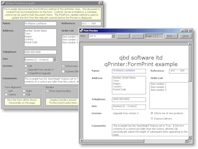



## qPrinter \(1\.6\.0\) \- improved print object with preview and form print

### Description

qPrinter is an enhanced Printer Object with Print Preview.

Now includes the FormPrint method to create documents from the text-based items of a form or container improving on the blocky bitmap of the PrintForm method in Visual Basic.

Standard documents can be created from TextItems and each item can have alignment, font, positioning, borders and shading properties set. TextItems can be positioned 'absolutely' on a specific page.

Changes to font, alignment and indentation properties can be made using HTML-style tags within the text of a TextItem.

Preview/Print features include zoom, preview window resizing, collation, number of copies and printer selection.

qPrinter also supports Headers and Footers.

A Test Project (PrinterTest.vbg) is included demonstrating some of the features.

Full documentation is available from our website http://www.qbdsoftware.co.uk/moth as well as downloads of a Dutch version and a Visual Basic 5 version.

You need to set the Error Handler (Tools>Options>General) to 'Break on unhandled errors'. This is in order for the project to catalog array based control items.
 
### More Info
 

             |
---                |---
**Submitted On**   |2001-07-07 14:39:40
**By**             |[Edward](https://github.com/Planet-Source-Code/PSCIndex/blob/master/ByAuthor/edward.md)
**Level**          |Advanced
**User Rating**    |4.9 (108 globes from 22 users)
**Compatibility**  |VB 5\.0, VB 6\.0
**Category**       |[Miscellaneous](https://github.com/Planet-Source-Code/PSCIndex/blob/master/ByCategory/miscellaneous__1-1.md)
**World**          |[Visual Basic](https://github.com/Planet-Source-Code/PSCIndex/blob/master/ByWorld/visual-basic.md)
**Archive File**   |[qPrinter \(22376772001\.zip](https://github.com/Planet-Source-Code/edward-qprinter-1-6-0-improved-print-object-with-preview-and-form-print__1-24811/archive/master.zip)

